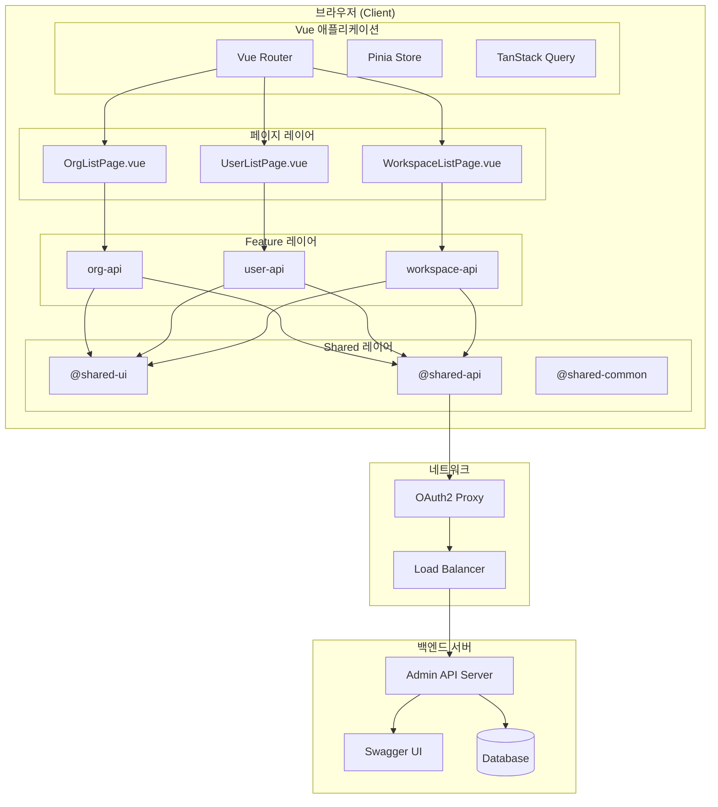
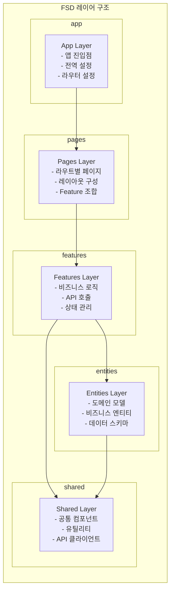
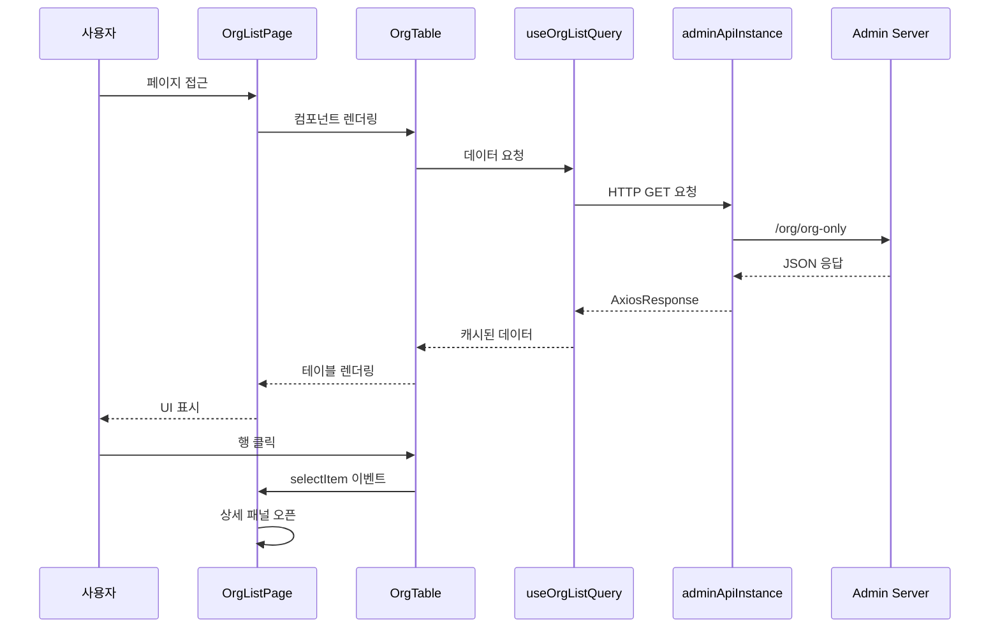
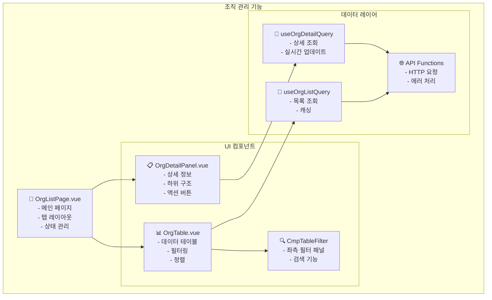
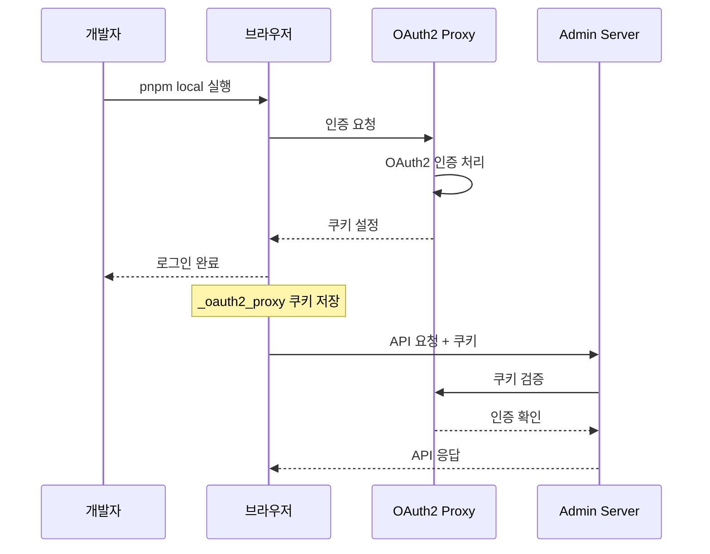
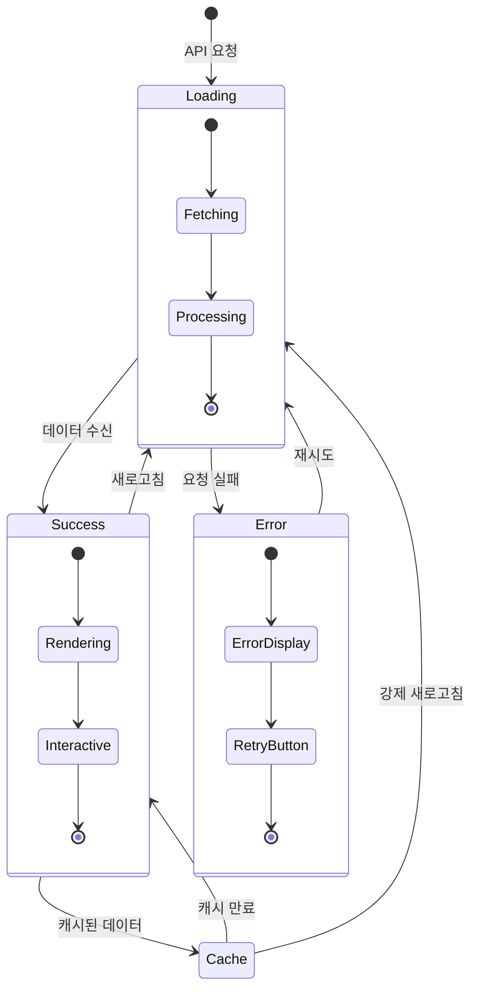
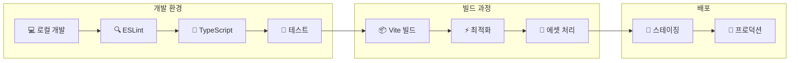
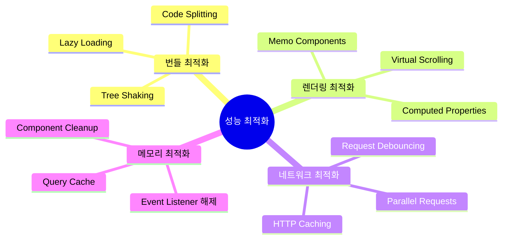

# 스웨거 API 컴포넌트 아키텍처 다이어그램

## 🏗️ 전체 시스템 아키텍처



## 📦 FSD (Feature-Sliced Design) 구조



## 🔄 데이터 플로우 다이어그램



## 🧩 컴포넌트 구조 다이어그램



## 🔐 인증 플로우 다이어그램



## 📊 상태 관리 다이어그램



## 🛠️ 빌드 및 배포 파이프라인



## 📁 파일 구조 맵

```
packages/cmp/src/features/org-api/
├── 📂 api/
│   ├── 📄 index.ts                    # API 엔드포인트 및 함수 정의
│   ├── 📄 queryKeys.ts                # React Query 키 관리
│   ├── 📄 useOrgListQuery.ts          # 목록 조회 훅
│   ├── 📄 useSimpleOrgListQuery.ts    # 단순 목록 훅
│   └── 📄 useOrgDetailQuery.ts        # 상세 조회 훅
├── 📂 ui/
│   ├── 📄 OrgTable.vue                # 조직 목록 테이블
│   └── 📄 OrgDetailPanel.vue          # 조직 상세 패널
├── 📄 types.ts                        # TypeScript 타입 정의
└── 📄 index.ts                        # Public API exports

packages/cmp/src/pages/org/
├── 📂 ui/
│   └── 📄 OrgListPage.vue             # 메인 페이지 컴포넌트
└── 📄 index.ts                        # Vue Router 정의
```

## 🎯 성능 최적화 포인트



---

**다이어그램 작성일**: 2025년 1월 9일  
**도구**: Mermaid.js  
**작성자**: 조기현